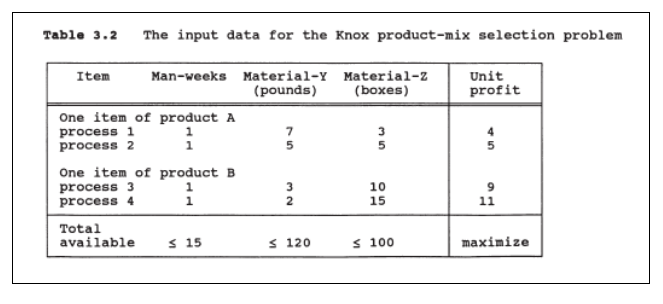
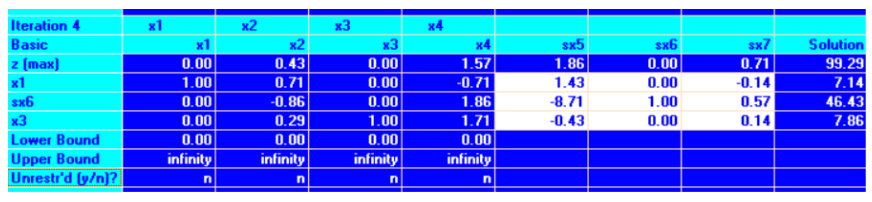
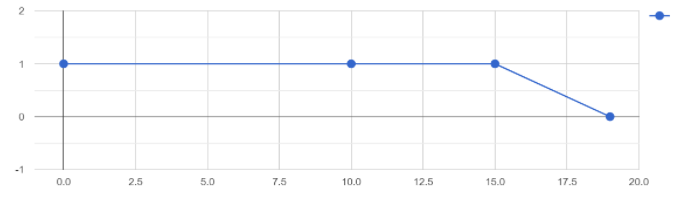
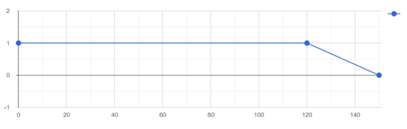
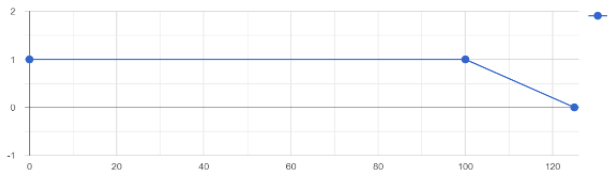
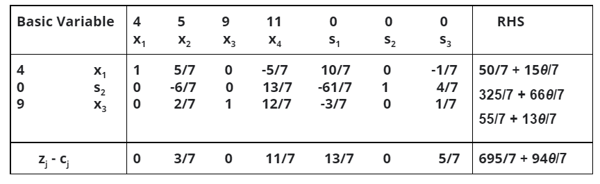
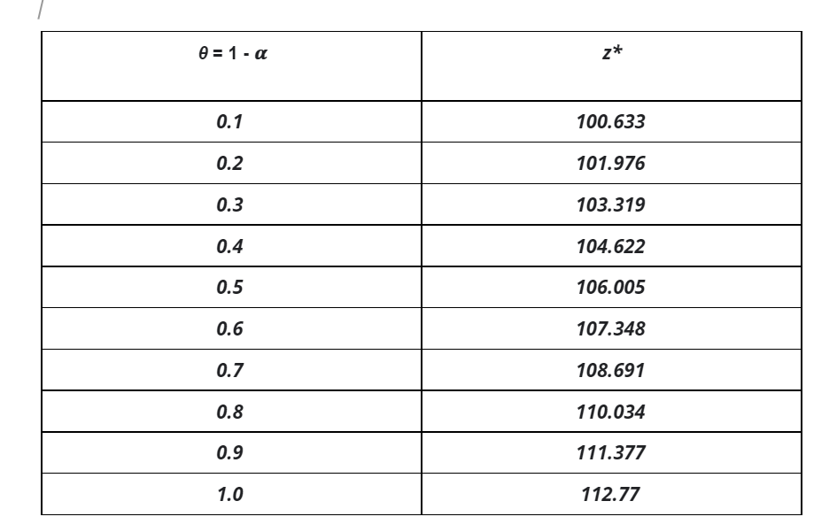

## Abstract 
In problems of classical system analysis, it is ubiquitous to treat imprecision by the use of probability theory. It is becoming increasingly clear, however, that in the case of many real world problems involving large scale systems such as economic systems, social systems, mass service systems, etc., the major source of imprecision should more properly be labeled ‘fuzziness’ rather than ‘randomness.’ By fuzziness, we mean the type of imprecision which is associated with the lack of sharp transition from membership to nonmembership, as in tall men, small numbers, likely events, etc. In our approach, the emphasis is on mathematical programming and the use of the concept of a level set to extend some of the classical results to problems involving fuzzy constraints and objective functions.

## The Knox production-Mix Selection Problem (Verdegays Model)
Let us consider a product-mix selection problem . Suppose that the Knox Mix company has the option of using one or more of four different types of production processes. The first and second processes yield items of product A, and the third and fourth yield items of product B. The inputs for each process are labor measured in man-weeks, pounds of material Y, and boxes of material Z. Since each process varies in its input requirements, the 81 profitabilities of the process differ, even for processes producing the same item. The manufacturer's decision on a week's production schedule is limited in the range of possibilities by the available amounts of manpower and both kinds of raw materials.



## Formulation of Optimization Problem

With production levels in processes 1, 2, 3, 4 as x1, x2, x3, x4 respectively. The problem can then be formulated as <br />
z = 4x1 + 5x2 + 9x3 + 11x4			(Profit)<br />
       Max z subject to constraints <br />
g1(x)  =   x1 + x2 + x3 + x4   <  15			(Man Weeks) <br />
g2(x)  =   7x1 + 5x2 + 3x3 + 2x4  <  120		(Material Y) <br />
g3(x)  =   3x1 + 5x2 + 10x3 + 15x4  < 100		(Material Z) <br />

We then solve this linear programming problem by use of the Simplex Method - (using Tora Software) . The optimal solution is: 



```x* = (50 / 7, 0, 55 / 7, 0)  =  (7.14, 0, 7.86, 0) and z* = $ 695 / 7 = $99.29. The actual resources used are  15, 73.57 and 100 units for manweeks, material Y and material Z, respectively``` 

Let us assume that the available  constraints in the above problem are imprecise with a tolerance of 25%. Then the membership function of fuzzy constraints are

```
                     1					if g1(x)  <  15
μ1(x) =    1 - [ (g1(x) - 15) / 4]        		if 15 <  g1(x)  <  1
                     0					if g1(x)  >  19
              
```


```
                     1				      	if g2(x) < 120
μ2(x) =     1 - [ (g2(x) - 120) / 30]        	       if 120 <  g2(x)  <  150
	              0					if g2(x) > 150
              
```


``` 
      	       1				     	if g3(x) < 100
μ3(x) =    1 - [ (g3(x) - 100) / 25]        	if 100 <  g3(x)  <  125
	       0				   	if g3(x) > 125

```


Thus we have the following problem to solve:
```
		           z = 4x1 + 5x2 + 9x3 + 11x4	
         Max z subject to constraints
       	
  		μ1(x)   >    𝜶  
	  	μ2(x)   >    𝜶
  		μ3(x)   >    𝜶

	𝜶 ∈ [0, 1] 	and 	x1, x2, x3, x4 > 0 
```
which is nothing but:
```
 		z = 4x1 + 5x2 + 9x3 + 11x4	
          Max z subject to constraints
 g1(x)  =   x1 + x2 + x3 + x4   <  15 + 4(1 - 𝜶)        		(Man Weeks)
 g2(x)  =   7x1 + 5x2 + 3x3 + 2x4  <  120 + 30(1 - 𝜶)   		(Material Y)
 g3(x)  =   3x1 + 5x2 + 10x3 + 15x4  < 100 + 25(1 - 𝜶)	  	        (Material Z)
	𝜶 ∈ [0, 1] 	and 	x1, x2, x3, x4 > 0
```
Set θ = 1 - 𝜶, we get the following parametric programming problem
```
z = 4x1 + 5x2 + 9x3 + 11x4	
          Max z subject to constraints
 g1(x)  =   x1 + x2 + x3 + x4   <  15 + 4θ       			(Man Weeks)
 g2(x)  =   7x1 + 5x2 + 3x3 + 2x4  <  120 + 30θ		   		(Material Y)
 g3(x)  =   3x1 + 5x2 + 10x3 + 15x4  < 100 + 25θ 	    	        (Material Z)

```
where θ ∈  [0, 1] is a parameter. By use of the parametric technique and the final table of the simplex method shown in Table above, we can obtain the following parametric results:  (15θ/7,  66θ/7, 13θ/7)  
The final simplex table is shown below. Since the RHS ( 50/7 + 15θ/7 ), (325/7 + 66θ/7) and (55/7 + 13θ/7), for θ ∈ [0,1], are always greater than zero, the optimal solution is then: 
        `` x* = (7.14 + 2.14θ, 0, 7.86 + 1.85θ, 0), and z* = $ (99.29 + 13.43θ). ``
	
The final parametric tableau of the simplex method for the Knox selection problem:



## Result
The solutions obtained for parametric programming problem are-



## References 
1. Fuzzy Mathematical Programming (Young-Jou Lai,Ching-Lai Hwang)
2. Tora Software (Hamdy A. Taha)
3. Lai, Y.J. and C.L. Hwang, Interactive fuzzy linear programming, Fuzzy Sets and Systems 45 (1992) 169-183.
4. Negoita, C.V. and D. Ralescu, Simulation, Knowledge-Based, Computing, and Fuzzy Statistics (Van Nostrand Reinhold, New York, 1987).


